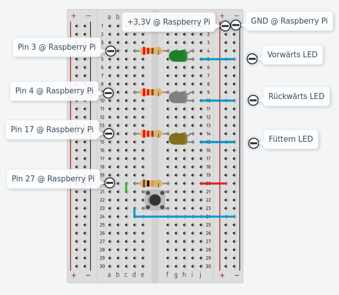

# imboccaTauro
Approach to fix a MixFeeder

## Fütterungssteuerung ##
Toursteuerung eines Fütterungsroboters

## Links ##
- https://raspberryautomation.com/raspberry-pi-relay-module-via-gpio/
- https://dev.to/tardisgallifrey/raspberry-pi-gpio-4-ways-45do
- https://projects-raspberry.com/introduction-to-accessing-the-raspberry-pis-gpio-in-c-sysfs/
- https://www.youtube.com/watch?v=Uq7fkcl6PWs
- https://mklimenko.github.io/english/2016/07/08/managing-threads-qt-en/
- https://howchoo.com/g/ndy1zte2yjn/how-to-set-up-wifi-on-your-raspberry-pi-without-ethernet

## Aufbau ##
1. Raspberry OS über Etcher auf SD-Karte
- `wget https://downloads.raspberrypi.org/raspios_armhf/images/raspios_armhf-2020-12-04/2020-12-02-raspios-buster-armhf.zip`
2. WLAN-Einstellungen auf OS setzen, falls kein Bildschirm vorhanden
- On SD card: `cd boot`
- `sudo nano wpa_supplicant.conf`
```
country=DE
ctrl_interface=DIR=/var/run/wpa_supplicant GROUP=netdev
network={
    ssid="<Network name>"
    psk="<password>"
    key_mgmt=WPA-PSK
}
```
4. Qt installieren
- `sudo apt-get update`
- `sudo apt-get upgrade`
- `sudo apt-get install qt5-default`
- `sudo apt-get qtcreator`
- `sudo qtcreator`
5. Raspberry-Gerät erstellen für die Kompillierung
- Tools -> Options -> Devices -> Devices -> Add -> Generic Linux Device
- Kits -> Add
6. Code von GitHub klonen
- `git clone https://github.com/PaulOberm/imboccaTauro.git`
7. Öffnen der .pro-Datei im QtCreator
8. Testschaltung aufbauen

- GPIO @ Raspberry PI: https://www.raspberrypi.org/documentation/usage/gpio/
9. Kompilieren auf Raspberry
10. Ausführen
- `./FeederBlinkDemo`

## Testschaltung ##

### Eingänge ###
- 2 Not-Aus
- 1 Waage
- 1 Sensor für Klappe
- Stopp
- 2 Markörsensoren

### Ausgänge ###
- 4 - 8 Relais für Futtertypen
- 1 Relais für Mischmotor
- 1 Relais für Klappe
- 2 Relais für Antriebsmotor
- 1 Näherungsschalter Antriebswelle

## Näherungsschalter ##
- Je 3 Kontakte

## Erweiterungen ##
- Temperaturabhängige Gewichtssteuerung (hohe Temperatur -> weniger Futter)
- Antrieb ohne gleichzeitige Positionsänderung (ohne Marköre) -> Störung (Indoor-Positionstechnologien?)
- Beidseitiges Auswerfen bzw. Steuerung der Auswerfrichtung


## Produktnummer ##
- 
- 

## Set up Raspberry for cross compilation##
- https://www.youtube.com/watch?v=TmtN3Rmx9Rk
